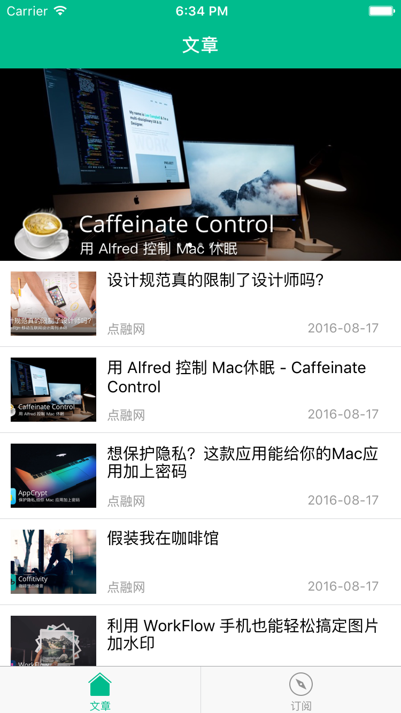
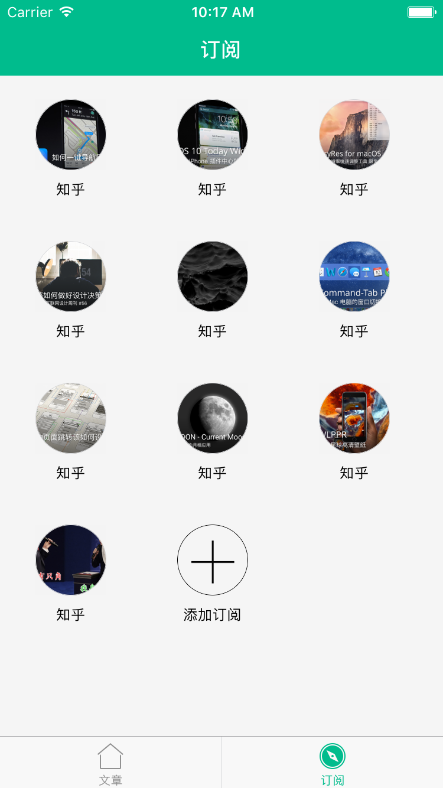

DRArticle
===

## 前言
这是一个纯ReactNative应用，同一套代码可以分别完整运行在iOS/Android 2个平台上，展现效果几乎相差无几

## 产品目标
DRArticle是一个微信公众号文章阅读应用，可以自由添加相关应用的订阅，然后在首页进行无障碍阅读


## 产品进度

目前只完成了前端页面开发，后端正在准备中，包括爬虫、api...

— **已弃坑** —

后端应该不会有兴趣再做了，前端从学到做只用了一星期，然后就没什么动力了

感谢  [@crazysheep](https://github.com/YoungLeeForeverBoy) 后期的代码补充

— — 

其实之前已经做了一个类似的已经上过Appstore的应用了，【采微】，纯native写的，当然也只是练手 


## 产品截图

[点击直接查看动图](http://ww3.sinaimg.cn/large/7dfdf1c5gw1f9874ae9psg20ad0iihdu.gif)





## 使用

环境配置参考 https://facebook.github.io/react-native/docs/getting-started.html
```
// 先安装依赖
npm install 

// 启动应用
react-native run-ios

```


